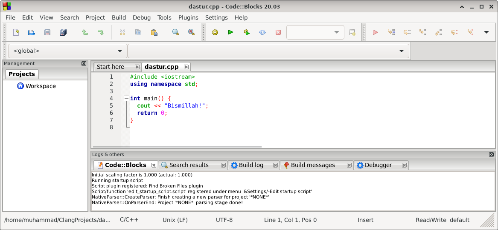

# Nimadan boshlash kerak?

C++ tilidan foydalanish uchun sizga 2 ta narsa kerak:

- Kod yozish uchun Notepad kabi matn muharriri
- C++ tilini kompyuter tushunadigan tilga o'girish uchun GCC kabi kompilyator

Tanlash uchun ko'plab matn muharrirlari va kompilyatorlar mavjud. Lekin eng qulayi bu - IDE dasturlardan foydalanish.

## C++ uchun IDE o'rnatish

IDE - bu "Integrated Development Environment" so'zlaridan olingan bo'lib, dasturchilar kod yozishi uchun kerak bo'lgan bir qancha narsalarni o'zida jamlagan dasturga nisbatan aytiladi. Uning yordamida bir vaqtning o'zida kodni yozish va kompilyatsiya qilish mumkin.

Mashxur IDE dasturlarga Code::Blocks, Eclipse, va Visual Studio kabilar kiradi. Bularning barchasi bepul hamda ular kodni tahrirlash va xatolarni topish uchun ishlatilishi mumkin.

**Eslatma:** Onlayn IDE dasturlar ham mavjud bo'lib, ulardan foydalanish sizdan yuklab olish va o'rnatish talab qilmaydi. Faqat yaxshi Internet bo'lishi kerak.

Code::Blocks dasturini quyida yuklab olishingiz mumkin:

### Microsoft Windows

<table>
  <tr>
    <th>Windows 64-bit</th>
    <th>Windows 32-bit</th>
  </tr>
  <tr>
    <td>
      <a href="https://www.fosshub.com/Code-Blocks.html?dwl=codeblocks-20.03mingw-setup.exe">FossHUB</a>
    </td>
    <td>
      <a href="https://www.fosshub.com/Code-Blocks.html?dwl=codeblocks-20.03mingw-32bit-setup.exe">FossHUB</a>
    </td>
  </tr>
  <tr>
    <td>
      <a href="https://sourceforge.net/projects/codeblocks/files/Binaries/20.03/Windows/codeblocks-20.03mingw-setup.exe">Sourceforge.net</a>
    </td>
    <td>
      <a href="https://sourceforge.net/projects/codeblocks/files/Binaries/20.03/Windows/codeblocks-20.03mingw-32bit-setup.exe">Sourceforge.net</a>
    </td>
  </tr>
</table>

### Debian

<table>
  <tr>
    <th>Debian 64-bit</th>
    <th>Debian 32-bit</th>
  </tr>
  <tr>
    <td>
      <a href="https://www.fosshub.com/Code-Blocks.html?dwl=codeblocks_20.03_amd64_stable.tar.xz">FossHUB</a>
    </td>
    <td>
      <a href="https://www.fosshub.com/Code-Blocks.html?dwl=codeblocks_20.03_i386_stable.tar.xz">FossHUB</a>
    </td>
  </tr>
  <tr>
    <td>
      <a href="https://sourceforge.net/projects/codeblocks/files/Binaries/20.03/Linux/Debian%2010/codeblocks_20.03_amd64_stable.tar.xz">Sourceforge.net</a>
    </td>
    <td>
      <a href="https://sourceforge.net/projects/codeblocks/files/Binaries/20.03/Linux/Debian%2010/codeblocks_20.03_i386_stable.tar.xz">Sourceforge.net</a>
    </td>
  </tr>
</table>

### MacOS X 12.6+ (32-bit)

- <a href="https://www.fosshub.com/Code-Blocks.html?dwl=CodeBlocks-13.12-mac.zip">FossHUB</a>
- <a href="https://sourceforge.net/projects/codeblocks/files/Binaries/13.12/MacOS/CodeBlocks-13.12-mac.zip">Sourceforge.net</a>

## Ilk qadam

Keling, birinchi C++ faylimizni yarataylik.

CodeBlocks dasturini oching va shu qadamlardan o'ting: **File > New > Empty File**

Quyidagi C++ kodini yozing va `dastur.cpp` nomi bilan saqlang. **(File > Save file as...)**:

```cpp
#include <iostream>
using namespace std;

int main() {
  cout << "Bismillah!";
  return 0;
}
```

Yuqoridagi kodni tushunmasangiz xavotir olmang, bu haqida keyingi mavzularda batafsil o'rganamiz. Hozircha shu kodni qanday ishlatishga diqqatingizni qarating.

CodeBlocks shunday holatda bo'lishi kerak:



Keyin, kodni ishga tushirish uchun bu yerga o'ting: **Build > Build and Run**. Natijada bunga o'xshash narsa ko'rinadi:

```
Bismillah!
Process returned 0 (0x0) execution time : 0.001 s
Press any key to continue.
```

> Ekranda chiqqan qora oyna - konsol (inglizcha: console) deyiladi.

**Tabriklaymiz!** Siz birinchi C++ dasturingizni yozdingiz va ishlatdingiz.
